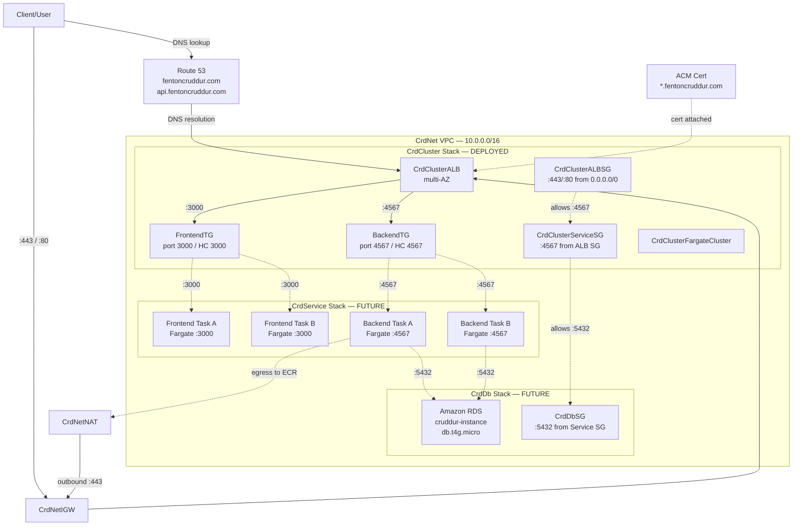

# Week 11 — CloudFormation Part 2: Compute Layer + Architecture Documentation

## What I Set Out To Do

Week 10 gave me a working CloudFormation networking stack (CrdNet). Week 11 was about four things on top of that:

1. **Refactoring the deploy workflow** to externalize configuration into a TOML file, so my scripts don't hardcode bucket names, regions, or stack names.
2. **Building the compute layer** — a new CrdCluster stack defining my ECS Fargate cluster, the Application Load Balancer, listeners, target groups, and the ALB security group, all consuming the networking exports from CrdNet.
3. **Drawing a comprehensive network architecture diagram in Lucid** as a portfolio artifact and a debugging insurance policy, covering all current stacks (CrdNet, CrdCluster) AND the future-state stacks (CrdDb, CrdService) plus production-grade additions like NAT Gateway and cross-stack exports.
4. **Documenting the entire architecture** in this journal as institutional knowledge that travels with the codebase.

This was the densest week of the bootcamp so far. By the end of it I had two CloudFormation stacks deployed end-to-end, all eight cluster resources running, every connection in my architecture mapped on paper with explicit port labels, a refactored deploy pipeline that follows the same configuration-externalization pattern used in real production systems, and a portfolio-ready architecture diagram that demonstrates production-grade thinking.

---

## Session A — cfn-toml Refactor

The detailed notes for this session live in `week11-session-a.md`, including the specific decisions I made (chose ruby-apt over snap for predictable system paths; used `--user-install` for cfn-toml to avoid sudo; kept `CFN_BUCKET` in `.bashrc` for interactive shell convenience while letting the TOML file own deploy-time config), the verification narrative, and the loose ends carried forward.

**Quick summary:** I refactored `bin/cfn/networking-deploy` to read bucket, region, and stack_name from `aws/cfn/networking/config.toml` instead of having those values baked into the script. Real values go in `config.toml` (gitignored). A placeholder `config.toml.example` is committed so anyone cloning the repo knows the schema. End-to-end verification confirmed the refactor produces an identical 18-resource, 5-export deploy — same outputs as Week 10, just sourced from a cleaner config layer.

This is the same configuration-externalization pattern I already use for `.env` files in the application code, now applied to infrastructure. Real-world value: the same script can deploy to dev, staging, and prod by pointing at different TOML files, with no script edits.

---

## Session B — Building the CrdCluster Stack

### What the Stack Contains

This is the compute layer of the application. The template at `aws/cfn/cluster/template.yaml` is 233 lines and defines:

- An ECS Fargate cluster with Container Insights enabled and a Service Connect namespace
- An internet-facing Application Load Balancer deployed across the three public subnets imported from CrdNet
- An HTTPS listener on port 443 with my ACM certificate for `*.fentoncruddur.com`, default forward to the frontend target group
- An HTTP listener on port 80 with a 301 redirect to HTTPS
- A listener rule routing any request with host header `api.fentoncruddur.com` to the backend target group (priority 1)
- A backend target group — port 4567, type `ip` (required for Fargate's `awsvpc` network mode), health check on `/api/health-check`
- A frontend target group — port 3000, type `ip`, health check on `/`
- An ALB security group allowing inbound TCP 443 and TCP 80 from `0.0.0.0/0`

**Eight resources total.** Five cross-stack outputs (ClusterName, ALBSecurityGroupId, HTTPSListenerArn, BackendTGArn, FrontendTGArn) that future stacks will consume.

### Cross-Stack Imports — The Whole Point of Layered IaC

CrdCluster imports values from CrdNet using the `!ImportValue` intrinsic:

```yaml
Properties:
  VpcId: !ImportValue CrdNetVpcId
  Subnets:
    Fn::Split:
      - ","
      - !ImportValue CrdNetPublicSubnetIds
```

That second pattern is worth pausing on. CrdNet exports `CrdNetPublicSubnetIds` as a comma-separated string because CloudFormation exports can only be strings, not lists. The cluster stack needs a list, so I have to split the string back at import time using the long-form `Fn::Split` intrinsic. The short-form `!Split` syntax does not nest cleanly inside `!ImportValue`. This is one of the bugs Andrew Brown specifically called out in his transcripts.

### Three Andrew-Known Bugs I Dodged Up Front

Andrew Brown documented three subtle bugs in his bootcamp transcripts that cost him hours in production. I made a point of dodging all three before deployment:

1. **Security group references for the ALB.** Use `!GetAtt ALBSecurityGroup.GroupId`, not `!Ref ALBSecurityGroup`. With `!Ref` you get the SG's logical name, not the GroupId the ALB resource actually needs, and the deploy fails with a confusing error.
2. **Subnet selection.** Pass only the three public subnets to the ALB, not all six. Internet-facing ALBs cannot live in private subnets, and passing more than one subnet per AZ produces a uniqueness conflict.
3. **Long-form intrinsic nesting.** Use `Fn::Split` when nesting inside `!ImportValue`, not the short-form `!Split`.

The fact that none of these surfaced during deploy is the best evidence I had them right.

### One Bug I Did Hit — YAML Indentation

I built the cluster template in five incremental chunks (parameters, resources, intrinsics, outputs, tagging). After chunk three, cfn-lint started complaining about an unrecognized property. After staring at the file for a few minutes I caught it — the property was at the wrong indentation level. YAML treats indentation as semantically meaningful, so an extra two spaces had turned a top-level resource property into a nested sub-property of the wrong key.

This is the kind of bug that doesn't exist in JSON (which uses explicit braces) but is a constant hazard in YAML. cfn-lint caught it in seconds; otherwise I would have caught it eventually at deploy time at much higher cost. The lesson is that **cfn-lint is a critical guardrail — every deploy script's first step**.

### The bash -x Detour

While testing the cluster deploy script for the first time, I accidentally ran `bash -x` against it. `bash -x` traces *and executes* every line — which meant the script ran end-to-end without my eyes on it, including the `aws cloudformation deploy` call. It uploaded the template to S3 and created a change set against a stub CrdCluster stack.

Because the script uses `--no-execute-changeset`, no resources were actually deployed. The stub stack and its change set were free to clean up:

```bash
aws cloudformation delete-stack --stack-name CrdCluster
```

The damage was zero, but the lesson was sharp: **read before you run**. Don't grab a script you're still tuning and pipe it through anything that auto-executes. That's the kind of mistake that, in a real production environment, ends up on a postmortem. I'd rather learn it here on a stub stack than later on a production cluster.

After cleanup, I committed the cluster scaffolding as commit `6402f77`:

```
feat(cfn): add cluster stack scaffolding for ECS Fargate + ALB
```

---

## Session C — End-to-End Deployment of CrdCluster

This was the big one. The first true deployment of the cluster stack against a live AWS account.

### Phase 1 — Deploy CrdNet First

The cluster stack imports from CrdNet, so the networking stack has to exist in the account before the cluster's `!ImportValue` references can resolve.

```bash
./bin/cfn/networking-deploy
```

Reviewed the change set in the Console (18 Add actions, all subnets, RTAs, routes, VPC, IGW). Executed. Stack reached `CREATE_COMPLETE` in about 25 seconds.

### Phase 2 — Deploy CrdCluster

```bash
./bin/cfn/cluster-deploy
```

This was the held-breath moment. Reviewed the change set carefully — 8 Add actions for FargateCluster, ALBSecurityGroup, ALB, HTTPSListener, HTTPListener, ApiALBListenerRule, FrontendTG, BackendTG. Reviewed the Parameters tab to confirm cfn-toml had populated the four expected values (the certificate ARN, the host header for `api.fentoncruddur.com`, the frontend health check path, the backend health check path). All correct. Executed.

The deploy took about three minutes total. **The ALB alone took roughly 75 seconds** — AWS provisions it across multiple AZs with health checking and DNS setup, and that orchestration is genuinely slower than spinning up lighter resources. On every future cluster deploy, the ALB will be the bottleneck.

The dependency cascade resolved exactly as expected: FargateCluster and ALBSecurityGroup first (parallel, no dependencies), then ALB (depends on the SG and the public subnets), then the two target groups (depend on the VPC), then the two listeners (depend on the ALB and TGs), then ApiALBListenerRule last (depends on the HTTPS listener and the backend TG).

All 8 resources reached `CREATE_COMPLETE`. The Outputs tab populated with the 5 expected exports. Cross-stack imports worked live. No bugs surfaced.

### Phase 3 — Teardown in Reverse Dependency Order

CloudFormation enforces a hard rule: **you cannot delete a stack whose exports are still being imported by another stack.** So teardown has to mirror deployment order — child stacks first, parent stacks last.

```bash
# CrdCluster first (ALB deletion is the bottleneck again — ~2 min)
aws cloudformation delete-stack --stack-name CrdCluster

# Confirm gone before deleting CrdNet
aws cloudformation describe-stacks --stack-name CrdCluster \
  --query "Stacks[0].StackStatus" --output text
# Expected: "Stack with id CrdCluster does not exist"

# Then CrdNet
aws cloudformation delete-stack --stack-name CrdNet
```

Both went clean. **The "mirror-image dependency reversal" is the pattern that applies to all layered IaC.** Deploy bottom-up, tear down top-down. I'll see this same shape on every multi-stack architecture for the rest of my career.

---

## Session D — The Network Architecture Diagram

The last and densest piece of the week. Andrew Brown explicitly called out in his transcripts that a clear network architecture diagram would have saved him hours of debugging on multiple occasions. The reason is simple: when you can see every connection and every port at a glance, certain classes of bug — like accidentally putting a service security group on port 80 when the container is listening on port 4567 — become visually obvious.

I built the diagram in Lucid using a layered approach: one prompt per architectural layer, then iterative manual cleanup. The Lucid URL is saved to my project memory, and exported PNG screenshots are committed to the repo.

### The Layered Build Approach

After an early attempt at single-prompt diagram generation produced cluttered, hard-to-correct output, I restarted with a disciplined layered approach. Each "layer" was added on top of the previous, with verification after each step:

1. **External resources** — Client/User, Route 53, ACM Certificate, AWS Cloud frame
2. **VPC and Internet Gateway** — CrdNet VPC at `10.0.0.0/16`, CrdNetIGW, Internet icon outside AWS Cloud
3. **Availability Zones, subnets, route tables** — three AZ columns side-by-side, each with one public above one private subnet, plus Public and Private Route Tables with their associations
4. **CrdCluster Stack (deployed, teal solid border)** — ALB spanning the public subnets, ALB Security Group, listeners with ACM cert and 301 redirect, target groups (Frontend on 3000, Backend on 4567 with HC port explicit), Fargate cluster, Service Security Group with the critical port 4567 annotation
5. **CrdDb Stack (future, green dashed border)** — RDS PostgreSQL, DB Subnet Group, DB Security Group, cross-SG reference allowing 5432 from Service SG
6. **CrdService Stack (future, magenta dashed border)** — Frontend and Backend Fargate tasks placed inside private subnets in us-east-1a and us-east-1b for high availability, with dashed lines to their target groups and from Backend tasks to RDS
7. **NAT Gateway addition** — CrdNetNAT in Public Subnet A with `outbound :443` to IGW, Private Route Table updated to route `0.0.0.0/0` to NAT (enables tasks to pull container images from ECR)
8. **Cross-Stack Exports table** — bottom-right corner, color-coded by stack, listing all 17 exports across the three stacks

### What the Diagram Shows

External entities on the left: a Client/User, Route 53 (managing both `fentoncruddur.com` and `api.fentoncruddur.com`), and ACM Certificate Manager (issuing the `*.fentoncruddur.com` certificate).

The AWS Cloud boundary on the right contains everything else:

- **CrdNet Stack (blue solid boundary)** — VPC `10.0.0.0/16`, CrdNetIGW, both route tables, and all six subnets organized into three vertical AZ columns (us-east-1a/b/c). Each column has one public subnet stacked above one private subnet.
- **CrdCluster Stack (teal solid boundary)** — the ALB spanning all three public subnets via attachment lines, both security groups (ALB SG with `:443/:80 from 0.0.0.0/0`, Service SG with `:4567 from ALB SG`), the Fargate cluster, and the two target groups with explicit port and health check port labels.
- **CrdDb Stack (green dashed boundary)** — RDS in the private subnets, the DB Subnet Group spanning Private A/B/C, the DB Security Group with `:5432 from Service SG`. Dashed because it's not yet built; that's Week 12.
- **CrdService Stack (magenta dashed boundary)** — Frontend and Backend Fargate task icons placed inside Private Subnet A and Private Subnet B (multi-AZ HA), with dashed lines connecting them to their target groups and Backend tasks connecting to RDS on port 5432.
- **CrdNetNAT (in Public Subnet A)** — outbound NAT Gateway providing internet egress for private subnet resources (specifically, for Fargate tasks to pull container images from ECR).
- **Cross-Stack Exports table (bottom-right, outside AWS Cloud)** — reference card showing 17 exports across three stacks, color-coded to match stack boundaries.

### Every Port Has a Label — On Purpose

Every connection line has its port labeled. The most important "insurance policy" labels:

- Internet → ALB on `:443 and :80`
- ALB → BackendTG on `:4567`
- ALB → FrontendTG on `:3000`
- BackendTG → Backend tasks on `:4567`
- FrontendTG → Frontend tasks on `:3000`
- Service SG inbound from ALB SG on `:4567` (**not :80** — see "Why This Diagram Exists" section below)
- Backend tasks → RDS on `:5432`
- DB SG inbound from Service SG on `:5432`
- Private subnet egress → NAT Gateway → IGW for ECR image pulls (`outbound :443`)

Every port label is "redundant" in the sense that the same information is available by clicking into AWS Console pages. **The redundancy is the point.** When the diagram is in front of me during a debugging session, port misalignment is visible at a glance.

### Lessons from Iterating with Lucid AI

Building this diagram took longer than expected because Lucid AI is unreliable for complex multi-component additions. Specifically:

- **Single-prompt mega-generation produces unusable output.** My first attempt to generate the whole diagram from one comprehensive prompt resulted in inverted spatial layout, AZ columns stacked instead of side-by-side, and connection lines routing through unrelated components.
- **Lucid AI is creative when it should be literal.** Multiple times it added components I didn't ask for (an extra "ECS Fargate Container" labeled wrong, a duplicate AWS Account wrapper) while skipping things I did ask for (HTTPS Listener annotations, security group ingress rules).
- **Position-and-add prompts get half-executed.** When a prompt includes "add component X at position Y with annotation Z and a connection line to W," Lucid AI tends to do one or two of those four things and ignore the rest.
- **Manual editing is faster after Layer 3.** Once the basic structure (VPC, subnets, route tables) was correct, every subsequent layer was faster to add by manually placing icons and drawing lines than by crafting prompts and correcting AI output.

**Practical conclusion for future AI-assisted diagramming:** Use AI prompts for initial scaffolding and high-level structure. Switch to manual editing for any layer with multiple components, positioning constraints, or annotations. Don't fight the tool.

### A Conceptual Detour: Target Groups vs. Security Groups

Midway through building the cluster layer, I drew the FrontendTG as a dashed container surrounding the public subnets because "tasks would eventually live there." This turned out to be wrong on two levels:

1. **Architectural error:** Frontend tasks belong in *private* subnets, not public. Only the ALB lives in public subnets. So drawing FrontendTG around the public subnets implied the wrong deployment model.
2. **Conceptual error:** Target Groups don't *contain* anything physically. A TG is a routing configuration — a list of registered target IPs maintained by the ALB. It tells the ALB "when traffic gets forwarded to me, send it to these IPs on this port, and use this port for health checks." It doesn't live in any subnet, doesn't have its own security group, and doesn't sit on the network plumbing layer.

The correct mental model is that TGs and SGs are at different points in the traffic flow, working *together* but never *containing* each other:

```
Internet → ALB SG → ALB → Listener Rule → Target Group → Task ENI → Service SG → Container
   (firewall)              (routing)        (routing)        (firewall)
```

ALB SG and Service SG are firewalls attached to ENIs. Target Groups are routing configurations. Listener Rules decide *which* TG receives the traffic.

**Interview takeaway:** "Target Groups and Security Groups serve completely different purposes. Target Groups are ALB routing configurations — they specify what port to forward to and how to health-check targets. Security Groups are firewall rules attached to network interfaces. In Fargate AWSVPC mode, each task gets its own ENI with the Service SG attached, and the ALB's ENIs have the ALB SG attached. When traffic flows from internet to container, it passes through the ALB SG, then gets routed by the listener to a Target Group, then forwarded to a task IP, where the Service SG decides whether to allow the connection on port 4567."

This is the kind of conceptual precision that distinguishes someone who knows the AWS icons from someone who understands the architecture.

### A Mermaid Recreation

For posterity in this journal, here's a Mermaid recreation of the Lucid diagram. It's lower-fidelity (no AWS icons, no perfect AZ columns, no color-coded stack boundaries), but it captures every resource, every cross-stack relationship, and every port label:



The [Lucid version](https://lucid.app/lucidchart/0e65b01c-09ab-454a-b812-49867b336cc7/edit?viewport_loc=4694%2C408%2C5880%2C2844%2C0_0&invitationId=inv_b3558d71-dd1e-451d-aba6-123ef84facc7) is the canonical one with proper AWS icons and clean spatial flow; this Mermaid version lives in the journal as a permanent record that travels with the codebase and renders in GitHub.

---

## Why This Diagram Exists: A Real Production Bug

This deserves its own section because it's the entire reason I invested the time.

### The Bug

In Andrew Brown's bootcamp transcripts, he and Bako spent two debugging sessions on a Fargate connectivity problem. The setup looked correct: ALB security group allowed port 80 from the internet, Service security group allowed port 80 from the ALB security group, target group was configured on the container's port (4567). The ALB couldn't reach the containers. Health checks failed. Traffic dropped.

The fix, after extensive debugging: **change the Service SG to allow port 4567 from the ALB SG, not port 80.** Also: explicitly set the target group health check port to 4567, not "traffic port" (which defaulted to something wrong).

### Why It Happens

Fargate's `awsvpc` networking mode is what causes this. In `awsvpc` mode, every task gets its own Elastic Network Interface (ENI) with its own private IP in the subnet. The ALB doesn't connect to tasks via the cluster's instance host port — it connects **directly to the task ENI on the container port**. There's no port translation between the ALB listener (:80 or :443) and the container port (:4567). The ALB just opens a TCP connection to `task-ip:4567`.

So the Service SG, which guards the task ENI, has to allow port 4567 — *the container port*, not the listener port. Anyone reasoning from "the ALB listens on 80, so the SG must allow 80" gets the architecture wrong and the deploy fails silently (health checks just don't pass).

### Why a Diagram Prevents This Bug

When the diagram is in front of you, the port chain is visible: `:443 → :4567 → :4567 → :5432`. There's no `:80` anywhere between the ALB and the container. Anyone — me, a teammate, an interview candidate I'm onboarding — can read this in 5 seconds and write the correct SG rule.

Without the diagram, the bug is invisible until deployment fails. With the diagram, the bug is impossible to introduce.

### The Interview Narrative

This is the answer to "tell me about a production debugging case study you've worked through":

> "During the bootcamp, we hit a Fargate networking bug where the service security group was configured to allow port 80 from the ALB security group, which seemed correct because port 80 is the ALB listener port. But Fargate's AWSVPC networking mode bypasses port translation — the ALB sends traffic directly to the task ENI on the container port. So the SG needed to allow 4567, not 80. It took two debugging sessions and another engineer to find. After that, I documented the architecture in a Lucid diagram with the port mapping called out as a CRITICAL annotation, so the bug can't reappear silently in future deployments. The diagram shows every connection labeled with its port, and the chain from ALB listener (443) to target group (4567) to container port (4567) to service SG (4567) to database (5432) is all visible at a glance. Want me to walk through it?"

That answer demonstrates: production debugging experience, AWS networking depth, infrastructure documentation discipline, and a habit of converting bugs into institutional knowledge. All four are things hiring managers explicitly look for in cloud engineering candidates.

---

## Cross-Cutting Lessons

### Cost Discipline

Both stacks were deployed, verified, and torn down within the same sessions. The ALB alone costs roughly $0.0225/hour (~$0.55/day) regardless of traffic. The other seven cluster resources are essentially free at rest, but the ALB is enough that I never leave it running between sessions. Every session ends with both stacks gone and `describe-stacks` returning "does not exist."

When CrdDb is added in Week 12, the RDS instance will become the new ongoing cost driver — `db.t4g.micro` is free-tier eligible but if I exhaust free-tier hours, it's roughly $0.016/hour. Still, the discipline holds: tear down at session close, redeploy at session start, prove reproducibility on every cycle.

### The Reproducibility Promise

I proved this week, on a more substantial scale than Week 10, that a 26-resource multi-stack architecture (18 networking + 8 cluster) can be torn down and rebuilt identically in roughly four minutes from two YAML files and two TOML configs. **That's the whole point of Infrastructure as Code.** Until you see it work, it's abstract. Once you watch it happen, it changes how you think about every piece of infrastructure you'll ever own.

### Read Before You Run

The `bash -x` incident was harmless because of the `--no-execute-changeset` guard, but it taught me something durable: I never want to be in a position where a script auto-executes its way past a step I haven't reviewed. From now on, every new script gets reviewed end-to-end before execution. Every deploy script uses `--no-execute-changeset` by default. Every destructive operation prompts for confirmation.

### AI Tooling: Useful but Untrusted

Lucid AI accelerated the early skeleton of the diagram but was unreliable for complex additions. The pattern I learned: AI is good for "scaffolding-shaped tasks" with one or two simple structural changes. AI is bad for "production-shaped tasks" with multiple positioning constraints, annotations, and connection requirements. The judgment is *when to switch from AI to manual editing*, and the cost of switching too late is wasted prompt cycles and frustrated iteration.

This pattern almost certainly generalizes beyond diagramming. AI as a force multiplier for the easy parts; human judgment for the parts where precision and architectural intent matter.

### Visual Documentation as Bug Prevention

The diagram isn't decoration. It's an active line of defense against a specific class of architectural bug. The next time I (or a teammate) configures a Fargate security group, the diagram on the wall makes the correct port choice obvious. The hour spent labeling every connection with its port saves an unknown number of future debugging hours — and that's the right trade for any production system.

### Target Groups Are Not Security Groups

The conceptual detour mid-diagram (drawing FrontendTG as a container, then learning that's wrong) was one of the highest-value learnings of the week. The precise model — TGs are routing, SGs are firewalls, and they operate at different points in the traffic flow — is the kind of detail that distinguishes engineers who can pass an AWS Solutions Architect exam from engineers who can actually debug production. Both required, but only one is interesting in an interview.

---

## Skills Demonstrated

For portfolio/interview purposes, here's what this week's work demonstrates:

- **Multi-stack CloudFormation architecture** with cross-stack imports/exports (`!ImportValue`, `Fn::Split`, `Outputs` with explicit `Export.Name`)
- **AWS networking patterns** — VPC, public/private subnets across AZs, Internet Gateway, NAT Gateway for private-subnet egress, route table associations
- **Defense-in-depth via SG-to-SG references** — security group rules referencing other security groups by ID, not by CIDR, for the complete chain Internet → ALB SG → Service SG → DB SG
- **Configuration externalization** via TOML files (`cfn-toml`) — separation of secrets, environment-specific values, and deployment metadata from code
- **Architectural documentation** as a portfolio artifact and bug-prevention layer
- **Production safety patterns** — `--no-execute-changeset` for change-set review, dependency-ordered deploy/teardown, deletion-policy thinking
- **Tooling judgment** — knowing when to use AI assistance vs. manual editing, recognizing when iteration costs exceed value
- **CloudFormation lifecycle thinking** — change sets vs. direct deploys, dependency cascades, the ALB as the consistent bottleneck
- **Fargate AWSVPC-mode networking** — understanding how task ENIs differ from instance host networking, why container ports flow through to security groups, why TG health checks need explicit port configuration

---

## Commands Reference

```bash
# Deploy CrdNet (must exist before CrdCluster)
./bin/cfn/networking-deploy

# Deploy CrdCluster (consumes CrdNet exports)
./bin/cfn/cluster-deploy

# Teardown in reverse order — CrdCluster first
aws cloudformation delete-stack --stack-name CrdCluster

# Confirm before tearing down CrdNet
aws cloudformation describe-stacks --stack-name CrdCluster \
  --query "Stacks[0].StackStatus" --output text

# Then CrdNet
aws cloudformation delete-stack --stack-name CrdNet

# Inspect stack outputs (verify cross-stack exports)
aws cloudformation describe-stacks --stack-name CrdCluster \
  --query "Stacks[0].Outputs" --output table

# Lint a template before deploy
cfn-lint aws/cfn/cluster/template.yaml

# Validate cfn-toml config parsing
cfn-toml -t aws/cfn/cluster/config.toml
```

---

## Progress Checklist

### Session A — cfn-toml Refactor
See `week11-session-a.md` for full notes.

- [x] Refactor `bin/cfn/networking-deploy` to read from `aws/cfn/networking/config.toml`
- [x] Create `config.toml.example` (committed) and `config.toml` (gitignored)
- [x] End-to-end verification — same 18 resources, same 5 outputs as Week 10 baseline

### Session B — CrdCluster Scaffolding
- [x] Write `aws/cfn/cluster/template.yaml` (233 lines, 8 resources, 5 outputs)
- [x] Define ECS Fargate cluster with Container Insights and Service Connect namespace
- [x] Define internet-facing ALB in public subnets imported from CrdNet
- [x] Define HTTPS listener (port 443) with ACM cert and default forward to FrontendTG
- [x] Define HTTP listener (port 80) with 301 redirect to HTTPS
- [x] Define listener rule routing `api.fentoncruddur.com` host header to BackendTG (priority 1)
- [x] Define FrontendTG (port 3000, type `ip`, health check `/`)
- [x] Define BackendTG (port 4567, type `ip`, health check `/api/health-check`)
- [x] Define ALBSecurityGroup (allow 443 and 80 from 0.0.0.0/0)
- [x] Create cfn-toml config files for cluster stack
- [x] Create `bin/cfn/cluster-deploy` using cfn-toml params v2 pattern
- [x] Catch and fix YAML indentation bug surfaced by cfn-lint
- [x] Dodge three Andrew-known bugs (SG `!GetAtt`, public-only subnets, long-form intrinsics)
- [x] Recover from accidental `bash -x` execution; verify zero damage
- [x] Commit cluster scaffolding as `6402f77`

### Session C — End-to-End Deployment
- [x] Deploy CrdNet (prerequisite for cluster imports)
- [x] Deploy CrdCluster end-to-end — all 8 resources reach `CREATE_COMPLETE`
- [x] Verify ALB took ~75 seconds (expected bottleneck)
- [x] Verify cross-stack imports resolved correctly (VpcId, PublicSubnetIds)
- [x] Verify three Andrew-known bugs all dodged (deploy success is the proof)
- [x] Verify 5 outputs populated in CrdCluster Outputs tab
- [x] Tear down CrdCluster first, then CrdNet (reverse dependency order)
- [x] Verify both stacks return "does not exist"

### Session D — Network Architecture Diagram
- [x] Plan diagram layout (external entities left, AWS Cloud right, AZ columns vertical)
- [x] Iterate through layered build approach (8 layers added incrementally)
- [x] Build CrdNet layer (VPC, IGW, 6 subnets, 2 route tables)
- [x] Build CrdCluster layer with ALB, security groups, target groups, Fargate cluster
- [x] Build CrdDb layer (future-state, green dashed) with RDS, DB SG, DB Subnet Group
- [x] Build CrdService layer (future-state, magenta dashed) with 4 Fargate tasks across 2 AZs
- [x] Add NAT Gateway in Public Subnet A with `outbound :443` line and updated Private Route Table
- [x] Add Cross-Stack Exports table in bottom-right, color-coded by stack
- [x] Label every connection line with its port number (especially `:4567` not `:80` for Service SG)
- [x] Color-code stacks (CrdNet blue, CrdCluster teal solid, CrdDb green dashed, CrdService magenta dashed)
- [x] Add CRITICAL callout next to Service SG explaining Fargate AWSVPC-mode requirement
- [x] Add cross-SG reference lines (`allows:4567`, `allows:5432`) showing complete security chain
- [x] Resolve TG-vs-SG conceptual confusion (TGs are routing, SGs are firewalls — not nested)
- [x] Save Lucid diagram URL to project memory
- [x] Recreate diagram in Mermaid for in-repo journal record
- [x] Export PNG screenshots and commit to repo

---

## Week 12 Work

Substantive engineering work for the next sessions:

- [ ] Update CrdCluster template to add `CrdClusterServiceSG` resource with `TCP 4567 from CrdClusterALBSG` ingress rule, plus `CrdClusterServiceSGId` export
- [ ] Deploy CrdCluster stack update (single resource addition)
- [ ] Build CrdDb stack for RDS PostgreSQL
  - Snapshot-restore from existing `cruddur-db-instance` in default VPC via `DBSnapshotIdentifier`
  - `DeletionPolicy: Snapshot` and `UpdateReplacePolicy: Snapshot`
  - `db.t4g.micro` (Graviton ARM, free-tier eligible)
  - PostgreSQL 16.x (modern engine version)
  - `PubliclyAccessible: false`
  - `DeletionProtection: true`
  - `BackupRetentionPeriod: 7` days
  - DB Subnet Group across all three private subnets
  - DB Security Group with `TCP 5432 from CrdClusterServiceSG` (cross-stack reference)
  - Automated SSM Parameter Store CONNECTION_URL update via deploy script
- [ ] Build CrdService stack for ECS service definitions
  - Two services (backend-flask, frontend-react-js)
  - Two tasks per service across us-east-1a and us-east-1b for HA
  - Service SG attached to task ENIs
  - Target group registration to BackendTG (port 4567) and FrontendTG (port 3000)
- [ ] Optional: migrate Route 53 records into CloudFormation (CrdDns stack)
- [ ] Optional: migrate CI/CD pipeline itself into CloudFormation (CrdCicd stack)

---

## Security & Hygiene Backlog

Operational/security work tracked but lower priority than the substantive engineering above:

- [ ] **P1:** Rotate RDS master password (was exposed in earlier journal entry on public repo)
- [ ] **P2:** Rotate IAM Access Key 1 on `C.Fenton_CLI`
- [ ] **P3:** Clean up Kiro IDE `trustedCommands` (remove `git reset --hard origin/main` and global git config commands)
- [ ] **P4:** Repo hygiene
  - Delete `backup/kiro-dev-pre-sync-20260502` branch
  - Harden `.gitignore` with `*.pem`, `*.key`, `__pycache__/` additions
- [ ] **P5:** Create `bin/cfn/teardown` script for ordered multi-stack teardown
- [ ] **External:** Follow up with Antwaun on SSL inspection bypass IT ticket for Docker domains

---

## Closing Thought

A 26-resource multi-stack architecture, deployed end-to-end and torn down clean, with every port mapping and security boundary documented in a portfolio-grade diagram. Week 10 made networking real; Week 11 made compute real *and* made the architecture visible. Week 12 will make data real and start tying the whole thing together as a deployable application.

The shift this week is one I'll keep with me: **infrastructure isn't just code that runs; it's documentation that prevents bugs.** Every label on the diagram, every export in the table, every comment in the YAML is preventing some specific class of mistake. That's what production-grade thinking looks like, and the bootcamp gave me the chance to learn the habit before the cost of not having it becomes severe.
