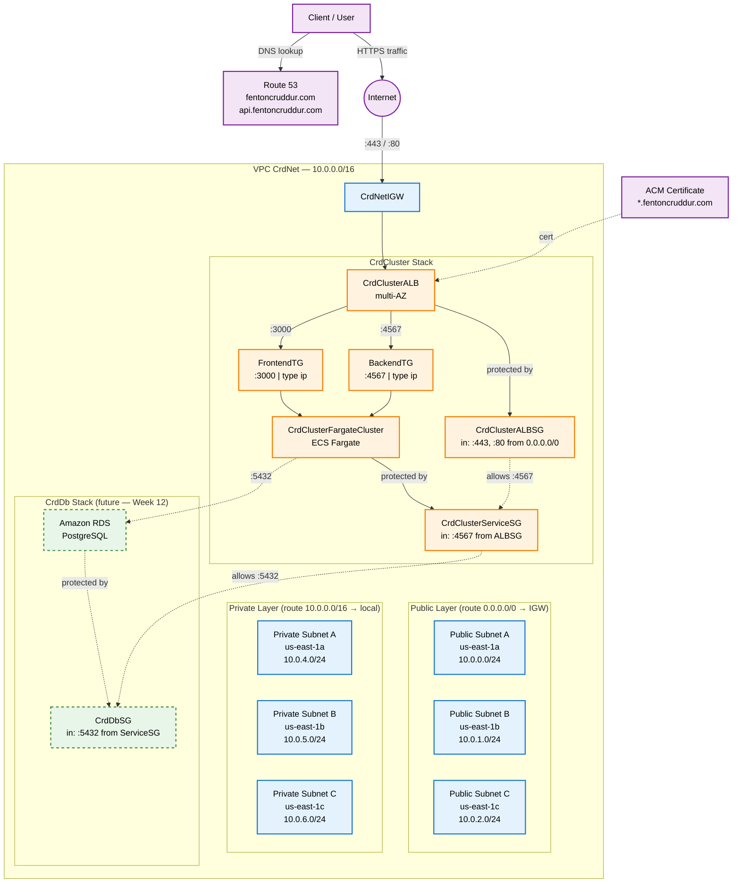

# Week 11 — CloudFormation Part 2

## What I Set Out To Do

Week 10 gave me a working CloudFormation networking stack (`CrdNet`). Week 11 was about three things on top of that:

1. **Refactoring the deploy workflow** to externalize configuration into a TOML file, so my scripts don't hardcode bucket names, regions, or stack names.
2. **Building the compute layer** — a new `CrdCluster` stack defining my ECS Fargate cluster, the Application Load Balancer, listeners, target groups, and the ALB security group, all consuming the networking exports from `CrdNet`.
3. **Drawing the network architecture diagram** in Lucid as a portfolio artifact and a debugging insurance policy.

This was the densest week of the bootcamp so far. By the end of it I had two CloudFormation stacks deployed end-to-end, all eight cluster resources running, every connection in my architecture mapped on paper with explicit port labels, and a refactored deploy pipeline that follows the same configuration-externalization pattern used in real production systems.

---

## Session A — `cfn-toml` Refactor

The detailed notes for this session live in **[`week11-session-a.md`](./week11-session-a.md)**, including the specific decisions I made (chose `ruby-apt` over `snap` for predictable system paths; used `--user-install` for cfn-toml to avoid `sudo`; kept `CFN_BUCKET` in `.bashrc` for interactive shell convenience while letting the TOML file own deploy-time config), the verification narrative, and the loose ends carried forward.

Quick summary: I refactored `bin/cfn/networking-deploy` to read `bucket`, `region`, and `stack_name` from `aws/cfn/networking/config.toml` instead of having those values baked into the script. Real values go in `config.toml` (gitignored). A placeholder `config.toml.example` is committed so anyone cloning the repo knows the schema. End-to-end verification confirmed the refactor produces an identical 18-resource, 5-export deploy — same outputs as Week 10, just sourced from a cleaner config layer.

This is the same configuration-externalization pattern I already use for `.env` files in the application code, now applied to infrastructure. Real-world value: the same script can deploy to dev, staging, and prod by pointing at different TOML files, with no script edits.

---

## Session B — Building the `CrdCluster` Stack

### What the Stack Contains

This is the compute layer of the application. The template at `aws/cfn/cluster/template.yaml` is 233 lines and defines:

- An **ECS Fargate cluster** with Container Insights enabled and a Service Connect namespace
- An **internet-facing Application Load Balancer** deployed across the three public subnets imported from `CrdNet`
- An **HTTPS listener on port 443** with my ACM certificate for `*.fentoncruddur.com`, default forward to the frontend target group
- An **HTTP listener on port 80** with a 301 redirect to HTTPS
- A **listener rule** routing any request with host header `api.fentoncruddur.com` to the backend target group (priority 1)
- A **backend target group** — port 4567, type `ip` (required for Fargate's `awsvpc` network mode), health check on `/api/health-check`
- A **frontend target group** — port 3000, type `ip`, health check on `/`
- An **ALB security group** allowing inbound TCP 443 and TCP 80 from `0.0.0.0/0`

Eight resources total. Five cross-stack outputs (`ClusterName`, `ALBSecurityGroupId`, `HTTPSListenerArn`, `BackendTGArn`, `FrontendTGArn`) that future stacks will consume.

### Cross-Stack Imports — The Whole Point of Layered IaC

`CrdCluster` imports values from `CrdNet` using the `!ImportValue` intrinsic:

```yaml
Properties:
  VpcId: !ImportValue CrdNetVpcId
  Subnets:
    Fn::Split:
      - ","
      - !ImportValue CrdNetPublicSubnetIds
```

That second pattern is worth pausing on. `CrdNet` exports `CrdNetPublicSubnetIds` as a comma-separated string because CloudFormation exports can only be strings, not lists. The cluster stack needs a list, so I have to split the string back at import time using the long-form `Fn::Split` intrinsic. The short-form `!Split` syntax does not nest cleanly inside `!ImportValue`. This is one of the bugs Andrew Brown specifically called out in his transcripts.

### Three Andrew-Known Bugs I Dodged Up Front

Andrew's transcripts cover three subtle bugs that cost him hours in production. I made a point of dodging all three before deployment:

1. **Security group references for the ALB.** Use `!GetAtt ALBSecurityGroup.GroupId`, not `!Ref ALBSecurityGroup`. With `!Ref` you get the SG's logical name, not the GroupId the ALB resource actually needs, and the deploy fails with a confusing error.
2. **Subnet selection.** Pass only the three public subnets to the ALB, not all six. Internet-facing ALBs cannot live in private subnets, and passing more than one subnet per AZ produces a uniqueness conflict.
3. **Long-form intrinsic nesting.** Use `Fn::Split` when nesting inside `!ImportValue`, not the short-form `!Split`.

The fact that none of these surfaced during deploy is the best evidence I had them right.

### One Bug I Did Hit — YAML Indentation

I built the cluster template in five incremental chunks (parameters, resources, intrinsics, outputs, tagging). After chunk three, `cfn-lint` started complaining about an unrecognized property. After staring at the file for a few minutes I caught it — the property was at the wrong indentation level. YAML treats indentation as semantically meaningful, so an extra two spaces had turned a top-level resource property into a nested sub-property of the wrong key.

This is the kind of bug that doesn't exist in JSON (which uses explicit braces) but is a constant hazard in YAML. `cfn-lint` caught it in seconds; otherwise I would have caught it eventually at deploy time at much higher cost. The lesson is that `cfn-lint` is a critical guardrail — every deploy script's first step.

### The `bash -x` Detour

While testing the cluster deploy script for the first time, I accidentally ran `bash -x` against it. `bash -x` traces and executes every line — which meant the script ran end-to-end *without my eyes on it*, including the `aws cloudformation deploy` call. It uploaded the template to S3 and created a change set against a stub `CrdCluster` stack.

Because the script uses `--no-execute-changeset`, **no resources were actually deployed**. The stub stack and its change set were free to clean up:

```bash
aws cloudformation delete-stack --stack-name CrdCluster
```

The damage was zero, but the lesson was sharp: **read before you run.** Don't grab a script you're still tuning and pipe it through anything that auto-executes. That's the kind of mistake that, in a real production environment, ends up on a postmortem. I'd rather learn it here on a stub stack than later on a production cluster.

After cleanup, I committed the cluster scaffolding as `6402f77`:

```
feat(cfn): add cluster stack scaffolding for ECS Fargate + ALB
```

---

## Session C — End-to-End Deployment of `CrdCluster`

This was the big one. The first true deployment of the cluster stack against a live AWS account.

### Phase 1 — Deploy CrdNet First

The cluster stack imports from `CrdNet`, so the networking stack has to exist in the account before the cluster's `!ImportValue` references can resolve.

```bash
./bin/cfn/networking-deploy
```

Reviewed the change set in the Console (18 Add actions, all subnets, RTAs, routes, VPC, IGW). Executed. Stack reached `CREATE_COMPLETE` in about 25 seconds.

### Phase 2 — Deploy CrdCluster

```bash
./bin/cfn/cluster-deploy
```

This was the held-breath moment. Reviewed the change set carefully — 8 Add actions for `FargateCluster`, `ALBSecurityGroup`, `ALB`, `HTTPSListener`, `HTTPListener`, `ApiALBListenerRule`, `FrontendTG`, `BackendTG`. Reviewed the Parameters tab to confirm cfn-toml had populated the four expected values (the certificate ARN, the host header for `api.fentoncruddur.com`, the frontend health check path, the backend health check path). Both correct. Executed.

The deploy took about three minutes total. The ALB alone took roughly 75 seconds — AWS provisions it across multiple AZs with health checking and DNS setup, and that orchestration is genuinely slower than spinning up lighter resources. On every future cluster deploy, the ALB will be the bottleneck.

The dependency cascade resolved exactly as expected: `FargateCluster` and `ALBSecurityGroup` first (parallel, no dependencies), then `ALB` (depends on the SG and the public subnets), then the two target groups (depend on the VPC), then the two listeners (depend on the ALB and TGs), then `ApiALBListenerRule` last (depends on the HTTPS listener and the backend TG).

All 8 resources reached `CREATE_COMPLETE`. The Outputs tab populated with the 5 expected exports. Cross-stack imports worked live. No bugs surfaced.

### Phase 3 — Teardown in Reverse Dependency Order

CloudFormation enforces a hard rule: you cannot delete a stack whose exports are still being imported by another stack. So teardown has to mirror deployment order — child stacks first, parent stacks last.

```bash
# CrdCluster first (ALB deletion is the bottleneck again — ~2 min)
aws cloudformation delete-stack --stack-name CrdCluster

# Confirm gone before deleting CrdNet
aws cloudformation describe-stacks --stack-name CrdCluster \
  --query "Stacks[0].StackStatus" --output text
# Expected: "Stack with id CrdCluster does not exist"

# Then CrdNet
aws cloudformation delete-stack --stack-name CrdNet
```

Both went clean. The "mirror-image dependency reversal" is the pattern that applies to all layered IaC. Deploy bottom-up, tear down top-down. I'll see this same shape on every multi-stack architecture for the rest of my career.

---

## Session D — The Network Architecture Diagram

The last big piece of the week. Andrew Brown explicitly called out in his transcripts that a clear network architecture diagram would have saved him hours of debugging on multiple occasions. The reason is simple: when you can *see* every connection and every port at a glance, certain classes of bug — like accidentally putting a service security group on port 80 when the container is listening on port 4567 — become visually obvious.

I built the diagram in Lucid using a layered AI-prompt approach (one prompt per layer, then iterative cleanup). The Lucid URL is saved to my project memory.

### What the Diagram Shows

External entities on the left: a Client/User, Route 53 (managing both `fentoncruddur.com` and `api.fentoncruddur.com`), and ACM Certificate Manager (issuing the `*.fentoncruddur.com` certificate).

The AWS Cloud boundary on the right contains:

- **CrdNet Stack (blue boundary)** — VPC `10.0.0.0/16`, the Internet Gateway, both route tables, and all six subnets organized into three vertical AZ columns (`us-east-1a/b/c`). Each column has one public subnet stacked above one private subnet.
- **CrdCluster Stack (orange boundary)** — the ALB, both security groups (ALB and Service), the Fargate cluster, the two target groups.
- **CrdDb Stack (green dashed boundary)** — RDS in the private subnets, the DB subnet group, the DB security group. Dashed because it's not yet built; that's Week 12.

Every connection line has its port labeled. The most important "insurance policy" labels:

- Client → ALB on `:443` and `:80`
- ALB → BackendTG → backend task on `:4567` (**not** `:80`)
- ALB → FrontendTG → frontend task on `:3000`
- ServiceSG inbound from ALBSG on `:4567` (**not** `:80`) — this is the bug that took Andrew and Bako two debugging sessions to find
- Backend task → RDS on `:5432`

Every port label is "redundant" in the sense that the same information is available by clicking into AWS Console pages. The redundancy is the point. When the diagram is in front of me during a debugging session, port misalignment is visible at a glance.

### A Mermaid Recreation

For posterity in this journal, here's a Mermaid recreation of the Lucid diagram. It's lower-fidelity (no AWS icons, no perfect AZ columns), but it captures every resource, every cross-stack relationship, and every port label:



### Why This Diagram Lives in My Repo

This is portfolio material. When an interviewer asks "walk me through your architecture," I can pull this up and point at every box. When I'm debugging a connectivity issue, I can trace the path from client to container with my finger and check whether each port matches what's deployed. When I add `CrdDb` and `CrdService` in Week 12, I'll convert those dashed boundaries to solid lines and the diagram evolves with the project.

The Lucid version is the canonical one; the Mermaid version above lives in this journal as a permanent record that travels with the codebase.

---

## Cross-Cutting Lessons

### Cost Discipline

Both stacks were deployed, verified, and torn down within the same sessions. The ALB alone costs roughly $0.0225/hour (~$0.55/day) regardless of traffic. The other seven cluster resources are essentially free at rest, but the ALB is enough that I never leave it running between sessions. Every session ends with both stacks gone and `describe-stacks` returning "does not exist."

### The Reproducibility Promise

I proved this week, on a more substantial scale than Week 10, that a 26-resource multi-stack architecture (18 networking + 8 cluster) can be torn down and rebuilt identically in roughly four minutes from two YAML files and two TOML configs. That's the whole point of Infrastructure as Code. Until you see it work, it's abstract. Once you watch it happen, it changes how you think about every piece of infrastructure you'll ever own.

### Read Before You Run

The `bash -x` incident was harmless because of the `--no-execute-changeset` guard, but it taught me something durable: I never want to be in a position where a script auto-executes its way past a step I haven't reviewed. From now on, every new script gets reviewed end-to-end before execution. Every deploy script uses `--no-execute-changeset` by default. Every destructive operation prompts for confirmation.

---

## Commands Reference

```bash
# Deploy CrdNet (must exist before CrdCluster)
./bin/cfn/networking-deploy

# Deploy CrdCluster (consumes CrdNet exports)
./bin/cfn/cluster-deploy

# Teardown in reverse order — CrdCluster first
aws cloudformation delete-stack --stack-name CrdCluster

# Confirm before tearing down CrdNet
aws cloudformation describe-stacks --stack-name CrdCluster \
  --query "Stacks[0].StackStatus" --output text

# Then CrdNet
aws cloudformation delete-stack --stack-name CrdNet

# Inspect stack outputs
aws cloudformation describe-stacks --stack-name CrdCluster \
  --query "Stacks[0].Outputs" --output table
```

---

## Progress Checklist

### Session A — `cfn-toml` Refactor
See [`week11-session-a.md`](./week11-session-a.md) for full notes.

- [x] Refactor `bin/cfn/networking-deploy` to read from `aws/cfn/networking/config.toml`
- [x] Create `config.toml.example` (committed) and `config.toml` (gitignored)
- [x] End-to-end verification — same 18 resources, same 5 outputs as Week 10 baseline

### Session B — `CrdCluster` Scaffolding
- [x] Write `aws/cfn/cluster/template.yaml` (233 lines, 8 resources, 5 outputs)
- [x] Define ECS Fargate cluster with Container Insights and Service Connect namespace
- [x] Define internet-facing ALB in public subnets imported from `CrdNet`
- [x] Define HTTPS listener (port 443) with ACM cert and default forward to FrontendTG
- [x] Define HTTP listener (port 80) with 301 redirect to HTTPS
- [x] Define listener rule routing `api.fentoncruddur.com` host header to BackendTG (priority 1)
- [x] Define FrontendTG (port 3000, type `ip`, health check `/`)
- [x] Define BackendTG (port 4567, type `ip`, health check `/api/health-check`)
- [x] Define ALBSecurityGroup (allow 443 and 80 from 0.0.0.0/0)
- [x] Create cfn-toml config files for cluster stack
- [x] Create `bin/cfn/cluster-deploy` using cfn-toml params v2 pattern
- [x] Catch and fix YAML indentation bug surfaced by `cfn-lint`
- [x] Dodge three Andrew-known bugs (SG `!GetAtt`, public-only subnets, long-form intrinsics)
- [x] Recover from accidental `bash -x` execution; verify zero damage
- [x] Commit cluster scaffolding as `6402f77`

### Session C — End-to-End Deployment
- [x] Deploy `CrdNet` (prerequisite for cluster imports)
- [x] Deploy `CrdCluster` end-to-end — all 8 resources reach CREATE_COMPLETE
- [x] Verify ALB took ~75 seconds (expected bottleneck)
- [x] Verify cross-stack imports resolved correctly (`VpcId`, `PublicSubnetIds`)
- [x] Verify three Andrew-known bugs all dodged (deploy success is the proof)
- [x] Verify 5 outputs populated in `CrdCluster` Outputs tab
- [x] Tear down `CrdCluster` first, then `CrdNet` (reverse dependency order)
- [x] Verify both stacks return "does not exist"

### Session D — Network Architecture Diagram
- [x] Plan diagram layout (external entities left, AWS Cloud right, AZ columns vertical)
- [x] Generate diagram via layered Lucid AI prompts
- [x] Label every connection line with its port number (especially `:4567 not :80` for ServiceSG)
- [x] Color-code stacks (CrdNet blue, CrdCluster orange, CrdDb green dashed)
- [x] Save Lucid diagram URL to project memory
- [x] Recreate diagram in Mermaid for in-repo journal record

### Carried Forward
- [ ] Build `CrdDb` stack for RDS PostgreSQL with `DeletionPolicy: Retain` and snapshot-restore from existing `cruddur-db-instance` (Week 12)
- [ ] Build `CrdService` stack for ECS service definitions (Week 12)
- [ ] Update `CrdCluster` to publish `CrdClusterServiceSGId` so `CrdDb` can reference it
- [ ] Send IT policy / SSL inspection bypass clarification request to Antwaun
- [ ] Rotate IAM Access Key 1 on `C.Fenton_CLI`
- [ ] Remediate sensitive value flagged in earlier journal entry (`journal/week4.md`)
- [ ] Harden `.gitignore` with `*.pem`, `*.key`, `__pycache__/` additions
- [ ] Optional: migrate Route 53 records and the CI/CD pipeline itself into CloudFormation
